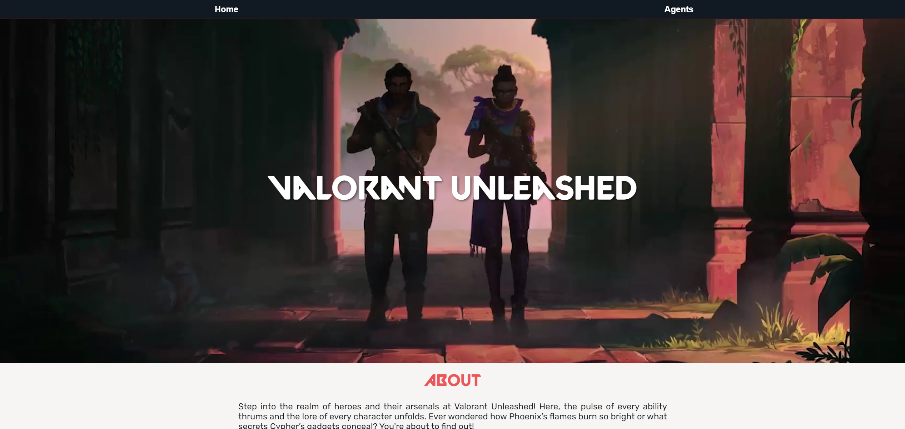
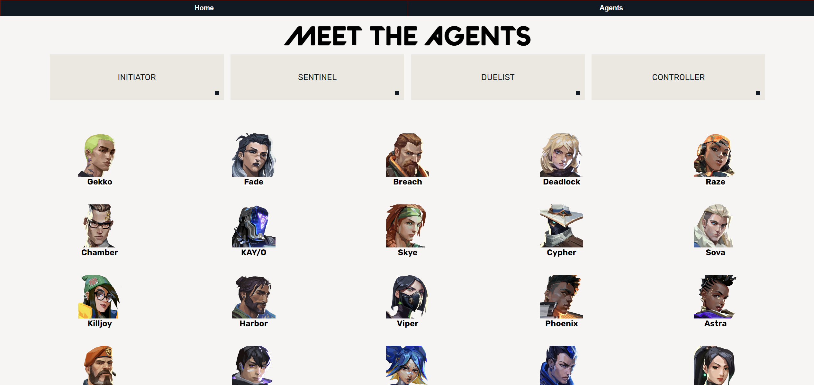

# App Title: Valorant Unleashed

Valorant Unleashed is an application which provides detailed information on every agent in the popular first-person shooter game 'Valorant'. Users are able to browse through the unique background, abilities, roles and other details. This help the user to understand more about each agent and choose which is best suited for their play style. This app leverages on the API provided by Valorant to fetch the most up-to-date information.

## Screenshot(s)

The landing page - About section describing the website and Valorant.

The agents page - shows the entire agents list in Valorant. Buttons categorized among the different roles each agent has.

## Technologies Used

- React.js for building the user interface
- Axios for making API requests
- React Router for navigation
- Node.js for the backend
- CSS3 for styling
- HTML5 for markup

## Getting Started

Click [here](https://github.com/chihiroloh/valorant-unleashed) to check out the deployed app.

To view the planning process and track the project's progress, check out our Google Sheets [here](https://docs.google.com/spreadsheets/d/1yNaxu04FzclWfnHDtUcRfaYb4rPiHrr-s6l4RSQiK-A/edit#gid=22121294).

## Next Steps

1. Add in video for each ability so users know what/how the ability is used
2. Add in more features;- Maps, Weapons, News, Leaderboards, Sign in/Sign out
3. Make the app into a mobile version (ios/andriod)
